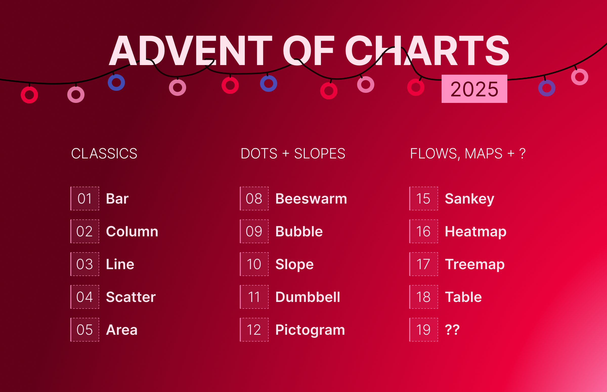

# Advent of Charts 2025

A month-long celebration of charts created by people at the Health Foundation. Each (week)day in December we will reveal a new chart, showcasing a variety of chart types and topics. 

We will share the charts in our Data Visualisation Teams channel. Let me know if you're not part of it and I can add you. 

## Want to join the fun?

**Recreate the chart to uplevel your Flourish skills or use any other tool!**

Each chart has been created in Flourish. You can follow along and recreate the chart using the data provided below. Or you can create your own chart using different data but the same chart type.  

Feel free to share your creations in the Data Visualisation Teams channel if you want.

## List of charts

| Day | Type | Output | Final chart | Data | Key steps |  
|-----|------------|--------|-------------|------|-----------|
| 1   | Bar  | [The hidden shield: emotional support amid childhood poverty and adversity](https://www.health.org.uk/features-and-opinion/blogs/the-hidden-shield-emotional-support-amid-childhood-poverty-and-adversity) (Fig2) | [Chart](https://public.flourish.studio/visualisation/25808870/) | [Data](https://thehealthfoundation98.sharepoint.com/:x:/r/sites/thf_site/departments/communications/Content%20and%20marketing/Content%20and%20brand/Data%20visualisation/2_Projects/Community%20of%20practice/Advent%20of%20charts/Advent%20of%20chart%202025_data.xlsx?d=wd09ece17702a4a39a66e0aeedf287aef&csf=1&web=1&e=cKqOZH&nav=MTVfezAwMDAwMDAwLTAwMDEtMDAwMC0wMDAwLTAwMDAwMDAwMDAwMH0) | Display bars in grid, ensure all bars have the same height, display value labels with % but don't show axis  |
| 2   | Column     |  |  |  |   |
| 3  | Line   |  |  |  |   |
| 4  | Scatter   |  |  |  |   |
| 5  | Area   |  |  |  |   |
| 8  | Beeswarm    |  |  |  |   |
| 9  | Bubble    |  |  |  |   |
| 10  | Slope   |  |  |  |   |
| 11  | Dumbbell    |  |  |  |   |
| 12  | Pictogram   |  |  |  |   |
| 15  | Sankey    |  |  |  |   |
| 16  | Heatmap   |  |  |  |   |
| 17  | Treemap  |  |  |  |   |
| 18  | Table   |  |  |  |   |
| 19  | ??    |  |  |  |   |